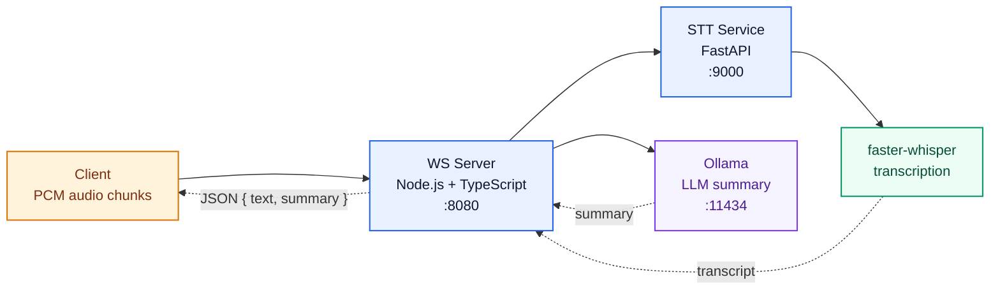

# Audio Server

> 🎙️ Real-time speech pipeline: client audio -> WebSocket ingestion -> speech-to-text -> LLM summary.


## Highlights

This repository combines two small services into one voice-processing pipeline:

- 🎧 `stt-service/` handles speech-to-text through `faster-whisper`
- 🌐 `src/` accepts PCM audio over WebSocket, buffers it, sends WAV to STT, then asks Ollama for a summary
- 🧠 the client receives a compact JSON response with `text` and `summary`

## Architecture



## Stack At a Glance

| Layer | Tech | Purpose |
| --- | --- | --- |
| Client | WebSocket client | Streams raw PCM chunks |
| Transport | `ws` + Node.js | Receives audio and returns results |
| STT API | FastAPI | Accepts uploaded WAV and returns transcription |
| Speech Engine | `faster-whisper` | Converts speech to text |
| LLM | Ollama (`llama3`) | Builds a short summary |

## Quick Start

### 1. Start Ollama 🧠

```bash
ollama pull llama3
ollama serve
```

Runs on `http://localhost:11434`.

### 2. Start the STT Service 🎙️

```bash
cd stt-service
python3 -m venv whisper-env
source whisper-env/bin/activate
pip install faster-whisper fastapi uvicorn python-multipart
uvicorn main:app --host 0.0.0.0 --port 9000
```

Runs on `http://localhost:9000`.

### 3. Start the WebSocket Server 🌐

```bash
npm install
npm run dev
```

Runs on `ws://localhost:8080`.

## STT Service (Python)

### Requirements

- Python 3.10+
- NVIDIA GPU for CUDA acceleration, or CPU fallback
- if using GPU: CUDA 12 runtime with `libcublas.so.12` available to the process

### Install CUDA / cuBLAS (`libcublas.so.12`)

These commands are for `Ubuntu 22.04 x86_64`.

```bash
wget https://developer.download.nvidia.com/compute/cuda/repos/ubuntu2204/x86_64/cuda-keyring_1.1-1_all.deb
sudo dpkg -i cuda-keyring_1.1-1_all.deb
sudo apt-get update

# Full toolkit
sudo apt-get install -y cuda-toolkit

# Or the narrower cuBLAS-only runtime path
sudo apt-get install -y libcublas-12-8 libcublas-dev-12-8
```

### Check GPU / CUDA / cuBLAS

```bash
nvidia-smi
ldconfig -p | grep libcublas.so.12
find /usr -name 'libcublas.so*' 2>/dev/null
find /usr/local -name 'libcublas.so*' 2>/dev/null
python3 -c "import ctypes; ctypes.CDLL('libcublas.so.12'); print('libcublas.so.12: OK')"
```

If the library exists but is still not found by Python, and `find` shows it under Ollama's CUDA runtime path:

```bash
export LD_LIBRARY_PATH=/usr/local/lib/ollama/cuda_v12:$LD_LIBRARY_PATH
python3 -c 'import ctypes; ctypes.CDLL("libcublas.so.12"); print("libcublas.so.12: OK")'

# Make it permanent
echo '/usr/local/lib/ollama/cuda_v12' | sudo tee /etc/ld.so.conf.d/ollama-cuda-v12.conf
sudo ldconfig
ldconfig -p | grep libcublas.so.12
```

### Verify

```bash
curl -X POST http://localhost:9000/transcribe \
  -F "file=@/path/to/audio.wav"
# {"language":"en","text":"...","device":"cuda","compute_type":"float16"}
```

If CUDA runtime cannot be loaded, the service falls back to CPU and the response will show `"device":"cpu"`.

## WebSocket Server (Node.js)

### Requirements

- Node.js 18+
- STT service running on `:9000`
- Ollama running with model `llama3` on `:11434`

### Setup

```bash
npm install
```

### Run

```bash
npm run dev
# or
npm run build && npm start
```

### Verify

```js
const ws = new WebSocket("ws://localhost:8080");

ws.onmessage = (event) => {
  console.log(JSON.parse(event.data));
};

// send binary PCM audio chunks via ws.send(audioBuffer)
// expected response: { text: "...", summary: "..." }
```

## Startup Order

1. `ollama serve`
2. `uvicorn main:app --host 0.0.0.0 --port 9000`
3. `npm run dev`
