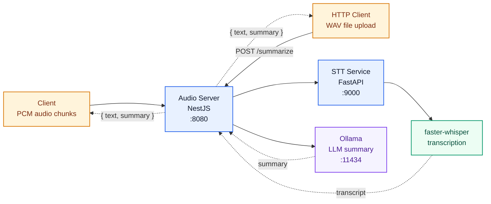

# Audio Server

> Real-time speech pipeline: client audio → WebSocket streaming or HTTP file upload → speech-to-text → LLM summary.


## Highlights

- `stt-service/` — Python FastAPI service that handles speech-to-text via `faster-whisper`
- `src/` — NestJS server that accepts PCM audio over WebSocket **or** a WAV file over HTTP, sends it through STT, then generates an LLM summary
- The client receives `{ text, summary }` JSON after each pipeline run

## Architecture



## NestJS Module Structure

```
src/
├── main.ts                                # Bootstrap: NestFactory, WsAdapter, body parsers
├── app.module.ts                          # Root module — wires ConfigModule + feature modules
│
├── config/
│   └── configuration.ts                  # Config factory loaded by @nestjs/config
│
├── audio/                                 # AudioModule — transport layer
│   ├── audio.module.ts
│   ├── audio.controller.ts               # POST /summarize (HTTP WAV upload)
│   ├── audio.gateway.ts                  # WebSocket gateway (binary PCM streaming)
│   ├── audio-pipeline.service.ts         # Orchestrates signal → WAV → STT → LLM
│   └── interfaces/
│       └── pipeline-result.interface.ts  # { text, summary }
│
├── stt/                                   # SttModule
│   ├── stt.module.ts
│   └── stt.service.ts                    # HTTP client → STT microservice (:9000)
│
├── llm/                                   # LlmModule
│   ├── llm.module.ts                     # Factory provider: selects Ollama or LM Studio
│   ├── llm.tokens.ts                     # LLM_SERVICE injection token
│   ├── ollama-llm.service.ts             # Ollama backend → /api/chat
│   ├── lm-studio-llm.service.ts          # LM Studio backend → OpenAI-compatible API
│   └── interfaces/
│       └── llm.interface.ts              # ILlmService: summarize(text): Promise<string>
│
└── common/
    └── utils/
        ├── signal.util.ts                # analyzePcmSignal — RMS/peak voice-activity gate
        ├── wav.util.ts                   # pcmToWav — RIFF/WAV header builder
        ├── errors.util.ts                # extractErrorDetails — normalises thrown values
        └── transcript.util.ts            # shouldIgnoreTranscript, hasEnoughContextForSummary
```

### Module dependency graph

```
AppModule
 ├── ConfigModule (global)
 ├── SttModule  ──────────────────────────────┐
 ├── LlmModule  ──────────────────────────────┤
 └── AudioModule                              │
      ├── imports SttModule ◄─────────────────┘
      ├── imports LlmModule ◄─────────────────┘
      ├── AudioController   (POST /summarize)
      ├── AudioGateway      (WebSocket PCM)
      └── AudioPipelineService
```

## Stack

| Layer | Technology | Purpose |
|---|---|---|
| Framework | NestJS 10 + Express | DI, modules, HTTP routing |
| Transport | `@nestjs/platform-ws` + `ws` | WebSocket on the same HTTP port |
| Config | `@nestjs/config` | Typed env-var loading |
| STT client | axios | Multipart WAV upload to FastAPI |
| LLM — Ollama | axios | `/api/chat` endpoint |
| LLM — LM Studio | `openai` SDK | OpenAI-compatible `/v1` endpoint |
| STT engine | FastAPI + `faster-whisper` | Speech-to-text microservice |

## Quick Start

### 1. Start Ollama

```bash
ollama pull llama3
ollama serve
```

Runs on `http://localhost:11434`.

### 2. Start the STT Service

```bash
cd stt-service
python3 -m venv whisper-env
source whisper-env/bin/activate
pip install faster-whisper fastapi uvicorn python-multipart
uvicorn main:app --host 0.0.0.0 --port 9000
```

Runs on `http://localhost:9000`.

### 3. Start the Audio Server

```bash
npm install
npm run dev
```

Runs on `localhost:8080` — serves both WebSocket and HTTP on the same port.

## STT Service (Python)

### Requirements

- Python 3.10+
- NVIDIA GPU for CUDA acceleration, or CPU fallback
- If using GPU: CUDA 12 runtime with `libcublas.so.12` available to the process

### Install CUDA / cuBLAS (`libcublas.so.12`)

These commands are for `Ubuntu 22.04 x86_64`.

```bash
wget https://developer.download.nvidia.com/compute/cuda/repos/ubuntu2204/x86_64/cuda-keyring_1.1-1_all.deb
sudo dpkg -i cuda-keyring_1.1-1_all.deb
sudo apt-get update

# Full toolkit
sudo apt-get install -y cuda-toolkit

# Or the narrower cuBLAS-only runtime path
sudo apt-get install -y libcublas-12-8 libcublas-dev-12-8
```

### Check GPU / CUDA / cuBLAS

```bash
nvidia-smi
ldconfig -p | grep libcublas.so.12
find /usr -name 'libcublas.so*' 2>/dev/null
python3 -c "import ctypes; ctypes.CDLL('libcublas.so.12'); print('libcublas.so.12: OK')"
```

If the library exists but is still not found by Python, and `find` shows it under Ollama's CUDA runtime path:

```bash
export LD_LIBRARY_PATH=/usr/local/lib/ollama/cuda_v12:$LD_LIBRARY_PATH
python3 -c 'import ctypes; ctypes.CDLL("libcublas.so.12"); print("libcublas.so.12: OK")'

# Make it permanent
echo '/usr/local/lib/ollama/cuda_v12' | sudo tee /etc/ld.so.conf.d/ollama-cuda-v12.conf
sudo ldconfig
ldconfig -p | grep libcublas.so.12
```

### Verify

```bash
curl -X POST http://localhost:9000/transcribe \
  -F "file=@/path/to/audio.wav"
# {"language":"en","text":"...","device":"cuda","compute_type":"float16"}
```

If CUDA runtime cannot be loaded the service falls back to CPU and the response will show `"device":"cpu"`.

## Audio Server (Node.js / NestJS)

### Requirements

- Node.js 18+
- STT service running on `:9000`
- Ollama running with model `llama3` on `:11434`

### Setup

```bash
npm install
```

### Run

```bash
npm run dev           # hot-reload via tsx watch
npm run build && npm start   # compile to dist/ then run
```

### WebSocket — real-time PCM streaming

Connect to `ws://localhost:8080` and send raw 16-bit little-endian PCM chunks (16 kHz, mono).
The server buffers incoming audio, flushes once enough data has accumulated (≥ 5 s), and sends back a JSON result.

```js
const ws = new WebSocket("ws://localhost:8080");

ws.onmessage = (event) => {
  const { text, summary } = JSON.parse(event.data);
  console.log("transcript:", text);
  console.log("summary:   ", summary);
};

// stream raw PCM chunks
ws.send(pcmBuffer); // ArrayBuffer or Buffer, binary
```

Expected response:
```json
{ "text": "We need to move the meeting to Thursday.", "summary": "The caller requested to reschedule the meeting to Thursday." }
```

### HTTP — upload a pre-recorded WAV file

`POST /summarize` accepts the raw WAV binary as the request body and returns the same JSON structure.

**curl**
```bash
curl -X POST http://localhost:8080/summarize \
  --data-binary @recording.wav \
  -H "Content-Type: audio/wav"
```

**fetch (browser / Node.js)**
```js
const wavBytes = await fs.readFile("recording.wav");

const response = await fetch("http://localhost:8080/summarize", {
  method: "POST",
  headers: { "Content-Type": "audio/wav" },
  body: wavBytes,
});

const { text, summary } = await response.json();
```

**Python**
```python
import requests

with open("recording.wav", "rb") as f:
    r = requests.post(
        "http://localhost:8080/summarize",
        data=f,
        headers={"Content-Type": "audio/wav"},
    )

print(r.json())
# {"text": "...", "summary": "..."}
```

**Response codes**

| Code | Meaning |
|---|---|
| `200` | Success — `{ text, summary }` returned |
| `422` | Audio produced no usable transcript (silent or filtered) |
| `500` | Internal pipeline failure |

## Environment Variables

All variables are optional — defaults are shown in the **Default** column.

| Variable | Default | Description |
|---|---|---|
| `WS_PORT` | `8080` | Port for both HTTP and WebSocket |
| `WS_HOST` | `0.0.0.0` | Bind address |
| `STT_URL` | `http://localhost:9000/transcribe` | STT service endpoint |
| `LLM_PROVIDER` | `ollama` | LLM backend: `ollama` or `lmstudio` |
| `OLLAMA_URL` | `http://localhost:11434/api/chat` | Ollama chat API endpoint |
| `OLLAMA_MODEL` | `llama3` | Ollama model name |
| `LM_STUDIO_URL` | `http://localhost:1234/v1` | LM Studio base URL (OpenAI-compatible) |
| `LM_STUDIO_MODEL` | `local-model` | Model identifier shown in LM Studio |
| `SUMMARY_LANGUAGE` | `English` | Language for the generated summary (e.g. `Russian`, `Spanish`) |
| `SUMMARY_MAX_SENTENCES` | `3` | Maximum sentences in the summary |
| `MIN_AUDIO_SECONDS` | `5` | Minimum buffered seconds before a WebSocket flush is triggered |
| `MIN_RMS` | `0.003` | RMS amplitude gate — audio below this is skipped |
| `DEBUG_SAVE_WAV` | _(off)_ | Set to `1` to save each processed WAV to disk |
| `DEBUG_WAV_PATH` | `/tmp/audio_server_debug.wav` | Path used when `DEBUG_SAVE_WAV=1` |

**Ollama example:**
```bash
LLM_PROVIDER=ollama \
OLLAMA_MODEL=mistral \
SUMMARY_LANGUAGE=Russian \
SUMMARY_MAX_SENTENCES=2 \
npm run dev
```

**LM Studio example:**
```bash
LLM_PROVIDER=lmstudio \
LM_STUDIO_URL=http://localhost:1234/v1 \
LM_STUDIO_MODEL=mistral-7b-instruct \
SUMMARY_LANGUAGE=Russian \
SUMMARY_MAX_SENTENCES=2 \
npm run dev
```

## Startup Order

1. `ollama serve` — LLM on `:11434`
2. `uvicorn main:app --host 0.0.0.0 --port 9000` — STT service on `:9000`
3. `npm run dev` — Audio Server on `:8080` (WS + HTTP)
